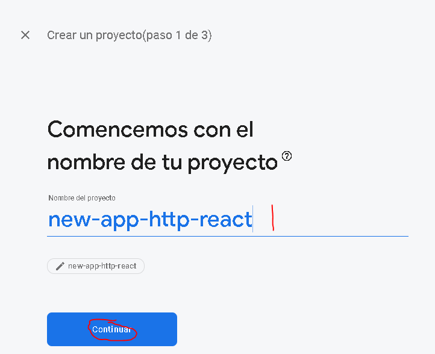
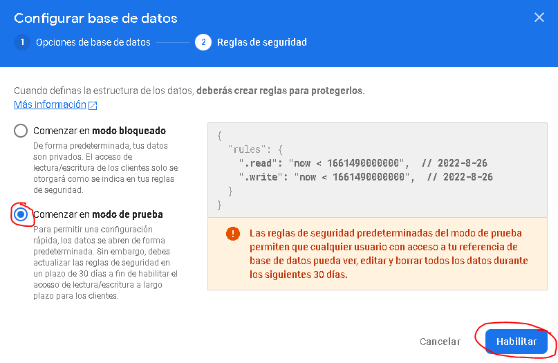

# Http-Request-React Project + Firebase Backend

## Description

This is a tiny web app that fetches movies descriptions from a backend server, the project shows simple http requests that you can make on ReactJS ⚛ with [fetch API](https://developer.mozilla.org/es/docs/Web/API/Fetch_API) and also using some important hooks such as `useEffect` and `useCallback`. The backend of the project is [firebase](https://firebase.google.com/).

## Setup

To start with the project just type on the terminal the following commands:

```
$ npm install
```

then the project does not correctly works yet first you must create a simple firebase application and realtime database, bellow the steps:

1. Go to [firebase](https://firebase.google.com/), and click on `Console` (You must have one account).
<p>
  
  <br>
  <em>Go to Console</em>
</p>

2. Then Create a new Project.
 <p>
  
  <br>
  <em>Create a new project</em>
</p>

3. Name your project and click continue
 <p>
  
  <br>
  <em>Naming the project</em>
</p>

4. Disable google Analytics option is not necessary, and then click on "Create Project".
 <p>
  
  <br>
  <em>Google Analytic no needed</em>
</p>

5. Wait some seconds and click continue.
 <p>
  
  <br>
  <em>Project created</em>
</p>

6. Go to real time database option.
 <p>
  
  <br>
  <em>Go to real time database</em>
</p>

7. Create a new real time database.
 <p>
  
  <br>
  <em>Create a new realtime database</em>
</p>

8. Select region.
 <p>
  
  <br>
  <em>Region (set it to default)</em>
</p>

9. Set the database to test mode.
 <p>
  
  <br>
  <em>Test mode only</em>
</p>

10. Now you can copy the following url to the project :).
 <p>
  
  <br>
  <em>Yujuuu</em>
</p>

Now that you setup your firebase backend just copy that url to the code project, on file `src\App.js` paste that url on `fetch()` calls and add the string "\movies.json".

```javascript
const response = await fetch("<your-firebase-url/movies.json>");
```

Now type on terminal, go to [http://localhost:3000/](http://localhost:3000/) and enjoy the app.

```
$ npm start
```

# Acknowledgements

Thanks to ([Maximilian Schwarzmüller](https://www.linkedin.com/in/maximilian-schwarzmueller/)) and his great React course on Udemy from where I extracted this content [Complete React Course](https://www.udemy.com/course/react-the-complete-guide-incl-redux/). I am learning a lot 👍.
